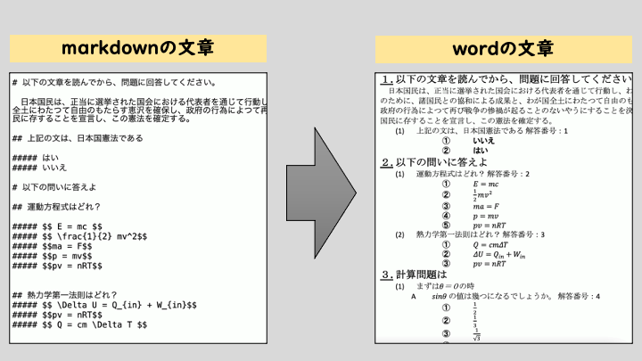

# markdown2定期試験
 **Pythonがないと動きません、私と同じ自治体の人は、校務PCでは使えません、残念！**



* markdown で試験問題の雛形を作り、pandocで.docxに変換します。
* watchdogで監視しmdの変更を自動検知してpandocで変換します。
* [mottox2
/
pandoc-word-starter](https://github.com/mottox2/pandoc-word-starter)をとても参考にしました。


## 環境構築

* Pandocをインストールしてください。
* python環境を構築してください。
* `pip install watchdog`で、watchdogをインストールしてください。
* `pip install word2pdf`をインストールしてください。


## 使い方
* `01_input.md`が操作対象になります。
* `python dog.py`で、ファイル監視が始まります(番犬に例えて、dogというプログラム名にしました。)。 
* mdの変更を検知すると、以下の通り、`#`の数で見出しの階層を判定して、pandocがwordファイルを出力します。

```html
<!-- 
------設問のタグ付け------(ここは消さない)
# 大問　：　14pt アンダーバー
## 小問：　10.5pt (1)
### セクション 10.5pt (A)
#### 小セクション 10.5pt (ア)

##### 選択肢 ①〜⑩
-->
```

* また、`dog.py`の上部で変換設定をコントロールできます。

``````Python
w2p_flag = True # PDFに変換するかどうか
kaitoBango = True # 回答番号の付記するかどうか
choiceSort = True # 選択肢のソートするかどうか
``````

* マーク等の選択肢を連番で降りたいときは、無駄な改行をせずに続けて記入してください。

``` markdown

##### 選択肢1
##### 選択肢2
##### 選択肢3
                    <!--無駄な空白行を入れちゃダメ！-->
##### 選択肢4(ダメな例)


```


## memo

* reference.docx の編集がかなり難しかった
    * Heading1の書式ではなく、wordのスタイルウィンドウから`見出し1`の`スタイル`を変更する
* 行頭揃えは、ルーラー機能を使うと便利。


